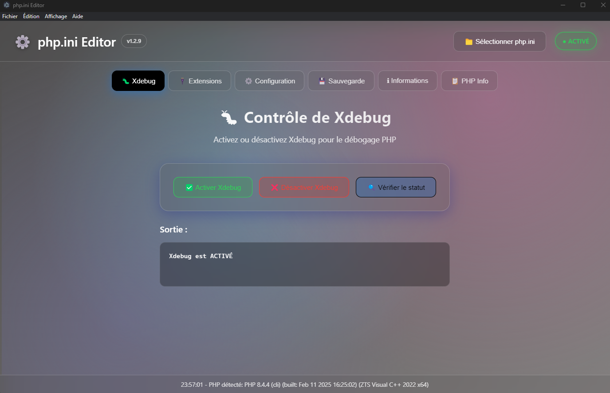

# PHP.ini Editor

> A beautiful and user-friendly desktop application to manage your PHP configuration (`php.ini`) and extensions — built with Electron.


---

## 📚 Table of Contents

- [🖥️ Screenshot](#️️-screenshot)
- [✨ Features](#-features)
- [🚀 Getting Started](#-getting-started)
- [🛠️ Requirements](#-requirements)
- [📦 Project Structure](#-project-structure)
- [❓ FAQ](#-faq)
- [🗺️ Roadmap](#-roadmap)
- [🔒 Security Notice](#-security-notice)
- [🤝 Contributing](#-contributing)
- [🙏 Credits](#-credits)
- [📄 License](#-license)
- [📬 Contact](#-contact)

---

## 🖥️ Screenshot



---

## ✨ Features

- ✅ Visual editor for your `php.ini` file
- ✅ One-click enable/disable for PHP extensions
- ✅ Toggle and check Xdebug status
- ✅ Instant search and filter for extensions
- ✅ Safe backup and restore of configuration
- ✅ Beautiful glassmorphism-inspired UI
- ✅ Works fully offline after installation

---

## 🚀 Getting Started

### 1. Download & Install

- Download the latest version from the [Releases](https://github.com/xFantooo/Php-IniEditor-My-first-App/releases)
- Extract the archive
- Launch `PHPiniEditor.exe`

### 2. How to Use

- Select your `php.ini` file (button at the top right)
- Use the navigation tabs:
  - **Xdebug**: enable/disable and view status
  - **Extensions**: toggle PHP extensions
  - **Config**: edit common `php.ini` options
- Click **Save** to apply changes
- Use the built-in **Backup/Restore** anytime

### 3. Build from Source (For Developers)

```bash
# Clone the repository
git clone https://github.com/xFantooo/Php-IniEditor-My-first-App.git
cd Php-IniEditor-My-first-App/

# Install dependencies
npm install

# Start in development mode
npm start

# Build Windows executable
npm run package-win
📁 Output: dist/PHPiniEditor-win32-x64/
📦 To distribute: Zip the folder and share it.

🛠️ Requirements
Windows 10 or 11 (64-bit)

Node.js (for development/build only)

PHP installed and accessible in your system PATH

📦 Project Structure
bash
Copier
Modifier
php.ini-Editor/
├── main.js               # Electron main process
├── preload.js            # IPC bridge
├── renderer.js           # Renderer logic
├── index.html            # User Interface
├── style.css             # Styling
├── toggle-xdebug.php     # PHP helper script
├── package.json          # Project configuration
├── icon.ico              # App icon
└── assets/
    └── screenshot.png    # Screenshot image
❓ FAQ
📌 The app doesn’t detect my php.ini. What should I do?
Ensure PHP is installed and its path is included in your system's environment variables.

📌 Is it compatible with Linux or macOS?
Currently, only Windows is supported. Cross-platform support is planned.

📌 Where is the backup stored?
In the same folder as your php.ini, with the name php.ini-backup.

🗺️ Roadmap
 Visual php.ini editor

 Xdebug toggle and status

 Extension toggling

 Backup and restore

 Multi-language UI (FR/EN)

 PHP.ini validation and cleaning

 Auto-detect changes to php.ini

 Linux/macOS support

🔒 Security Notice
⚠️ This tool modifies your php.ini file. Always ensure you back up your configuration before making changes.
✅ A built-in backup feature is included.

🤝 Contributing
Pull requests are welcome!
For major changes, please open an issue first to discuss what you'd like to improve.

🙏 Credits
Electron

PHP

Icons from Icons8

Built with ❤️ by xFantooo

📄 License
This project is licensed under the MIT License.

📬 Contact
If you have questions, suggestions, or want to contribute, feel free to open an issue or reach out on GitHub: @xFantooo
```
